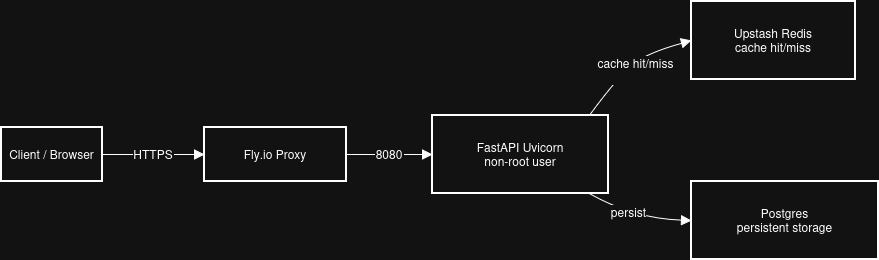

# LukestAWS URL Shortener 🚀

Production-grade URL shortener built with FastAPI, Postgres, Redis caching, Alembic migrations, and Docker.

[](https://aws-url-shortener.fly.dev)
[](https://aws-url-shortener.fly.dev/docs)
[](https://github.com/LukestAWS/aws-url-shortener/actions)

## Public Demo
- Health check: https://aws-url-shortener.fly.dev → {"message":"LukestAWS URL Shortener – healthy"}
- Swagger UI: https://aws-url-shortener.fly.dev/docs (Authorize with API key to test /shorten)
- Redoc: https://aws-url-shortener.fly.dev/redoc
- Redis caching LIVE: Second /shorten same URL → "cached": true + instant response

## Tech Stack
- FastAPI backend
- PostgreSQL (15-alpine) + Alembic migrations
- Redis caching (Upstash serverless)
- Docker Compose local dev + multi-stage Dockerfile
- Deployed on Fly.io (free tier)
- GitHub Actions CI/CD auto-deploy on push

Week 1–2 of 20-week AWS portfolio battle plan – Docker Fundamentals + Deep Dive **COMPLETE** ✅



## Architecture
```mermaid
graph LR
    A[Client] -->|HTTPS| B[Fly.io Proxy]
    B -->|8080| C[FastAPI Uvicorn<br/>non-root user]
    C --> D[Upstash Redis<br/>cache hit/miss]
    C --> E[Postgres<br/>persistent storage]
